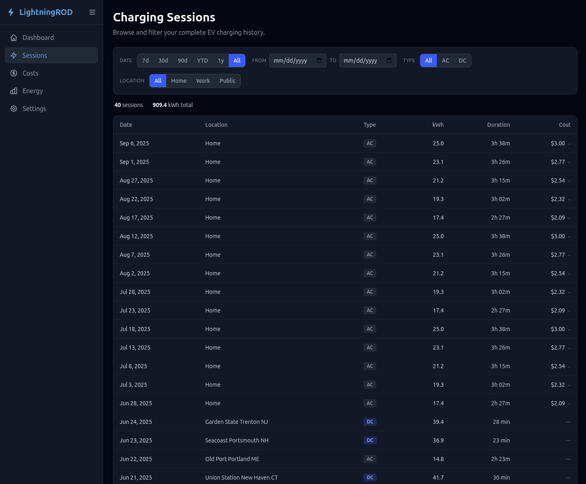
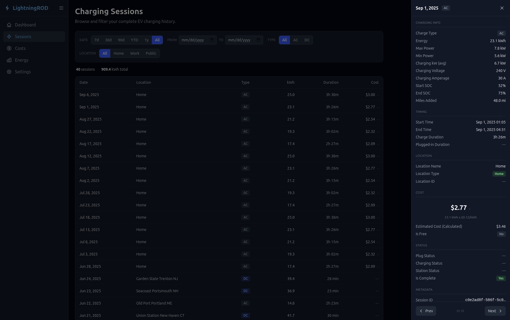
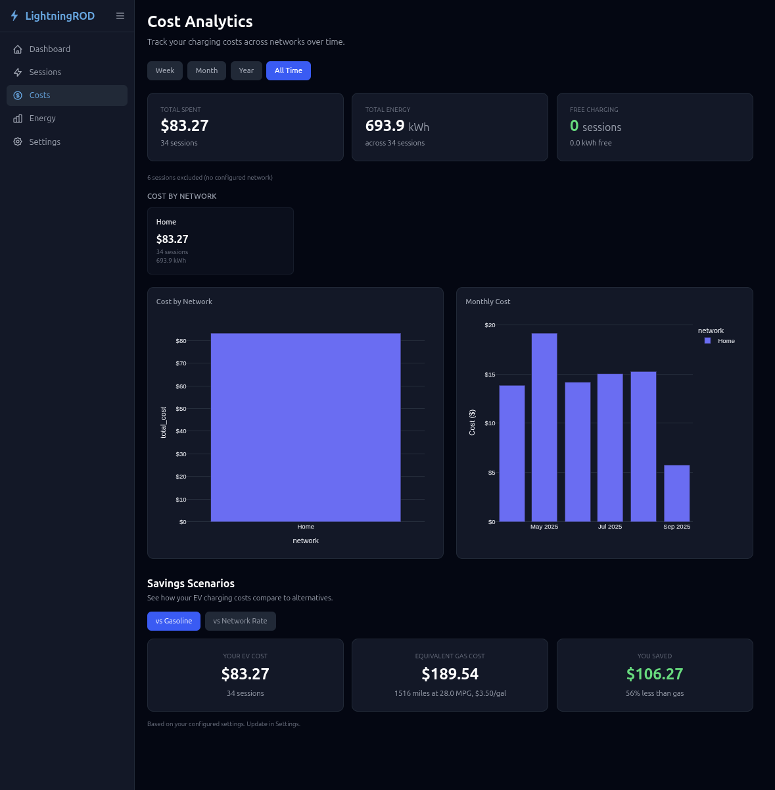
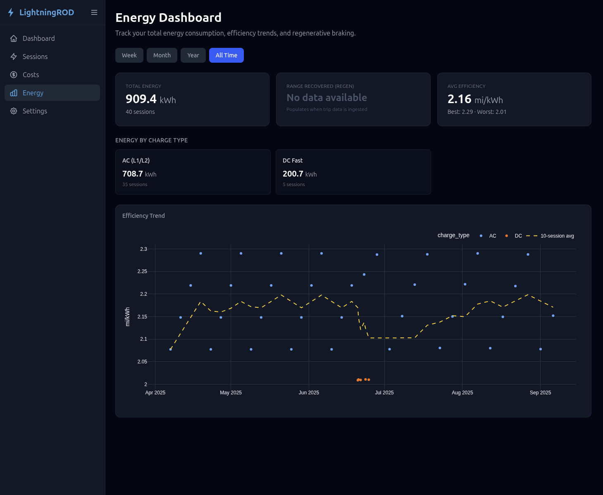
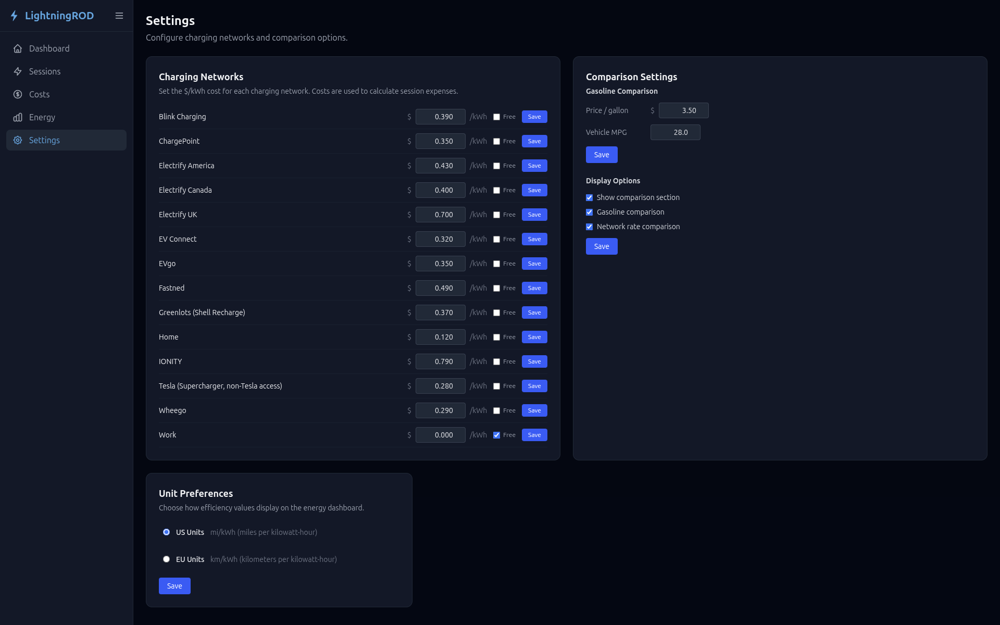

# LightningROD

Self-hosted charging analytics for Ford electric vehicles. Track charging sessions, analyze costs, and monitor energy consumption with a web-based dashboard.

Built for the Ford F-150 Lightning, but should work with any Ford EV.

> [!IMPORTANT]
> This is a work in progress

Currently using session data from a CSV file seeded at the start, but I have plans for alternative data sources
- Ultimate goal is to ingest all vehicle related data from Home Assistant

This is my own personal project. If you would like to, please consider buying me a coffee.

<a href="https://www.buymeacoffee.com/SquidBytes"></a>

## What It Does

- **Charging Sessions** -- Browse your complete charging history with filters for date range, charge type (AC/DC), and location (home, work, public). Each session expands into a detail view with all available fields.
- **Cost Analytics** -- Configure your network costs per location, see lifetime spending broken down by network, and compare what you would have paid at different rates or with a gas vehicle.
- **Energy Dashboard** -- Track total energy consumed, view efficiency trends over time (mi/kWh or km/kWh), and see regenerative braking totals.
- **Settings** -- Manage charging networks, set gas comparison parameters, toggle between US and EU units, and control which comparison sections appear.

## Tech Stack

| Layer | Technology |
|-------|-----------|
| Language | Python 3.11 |
| Web framework | FastAPI |
| Database | PostgreSQL 16 |
| ORM | SQLAlchemy 2.0 (async) |
| Migrations | Alembic |
| Templates | Jinja2 |
| Frontend | HTMX, Tailwind CSS, Plotly |
| Deployment | Docker Compose |

## Gallery

### Session List and drawer





### Cost Page



### Energy Page



### Settings Page




## Quick Start

### Docker Compose (recommended)

```bash
git clone https://github.com/yourusername/LightningROD.git
cd LightningROD
cp .env.example .env
# Edit .env -- at minimum, set a real POSTGRES_PASSWORD
docker compose up --build -d
```

The app will be available at `http://localhost:8000`. Migrations run automatically on startup.

### Seed Data

LightningROD starts with an empty database. Load the included demo data to get started, or import your own:

```bash
# Option 1: Demo data (40 fake sessions, included in repo)
docker compose exec web uv run python scripts/seed.py --vin DEMO_VIN --csv-path data/fake_charging_sessions_sample.csv

# Option 2: Your own data
docker compose exec web uv run python scripts/seed.py --vin YOUR_VIN
```

See the [Data Import](docs/getting-started/data-import.md) docs for CSV format details and classification rules.

## Configuration

Copy `.env.example` to `.env` and adjust as needed:

| Variable | Default | Description |
|----------|---------|-------------|
| `POSTGRES_USER` | `lightningrod` | PostgreSQL username |
| `POSTGRES_PASSWORD` | `changeme` | PostgreSQL password (change this) |
| `POSTGRES_DB` | `lightningrod` | Database name |
| `POSTGRES_HOST` | `localhost` | Database host (`db` when using Docker Compose) |
| `APP_PORT` | `8000` | Port the web UI is served on |
| `DEBUG` | `false` | Enable debug logging and SQL echo |

## Development Setup

If you want to run the application outside of Docker for development:

### Prerequisites

- Python 3.11+
- [uv](https://docs.astral.sh/uv/) (Python package manager)
- Docker (for PostgreSQL)

### Steps

```bash
# Install dependencies
uv sync

# Copy and edit environment config
cp .env.example .env

# Start PostgreSQL only (port 5432 exposed for local connections)
docker compose -f docker-compose.yml -f docker-compose.dev.yml up db -d

# Run database migrations
uv run alembic upgrade head

# Start the dev server with auto-reload
uv run uvicorn web.main:app --reload --port 8000
```

### Demo Data

```bash
# Seed the demo data
uv run python scripts/seed.py --vin DEMO_VIN --csv-path data/fake_charging_sessions_sample.csv

# Or with Docker:
docker compose exec web uv run python scripts/seed.py --vin DEMO_VIN --csv-path data/fake_charging_sessions_sample.csv
```

### Rebuilding CSS

The compiled Tailwind CSS (`static/css/output.css`) is committed to the repo. If you modify templates and need to rebuild:

```bash
./tailwindcss -i input.css -o static/css/output.css --minify
```

To get the Tailwind standalone CLI:

```bash
curl -sLO https://github.com/tailwindlabs/tailwindcss/releases/latest/download/tailwindcss-linux-x64
chmod +x tailwindcss-linux-x64
mv tailwindcss-linux-x64 tailwindcss
```

## Project Structure

```
LightningROD/
├── config.py                # Application settings (reads .env)
├── docker-compose.yml       # Production stack (web + db)
├── docker-compose.dev.yml   # Dev override (exposes db port 5432)
├── Dockerfile               # Python 3.11-slim container image
├── entrypoint.sh            # Runs migrations, then starts uvicorn
│
├── db/
│   ├── engine.py            # Async SQLAlchemy engine + session factory
│   ├── models/              # ORM models (8 tables)
│   └── migrations/          # Alembic migration files
│
├── web/
│   ├── main.py              # FastAPI app factory
│   ├── dependencies.py      # Database session dependency
│   ├── routes/              # Route handlers (sessions, costs, energy, settings)
│   ├── queries/             # Data access layer (separated from routes)
│   └── templates/           # Jinja2 templates with HTMX partials
│
├── scripts/
│   └── seed.py              # CSV-to-PostgreSQL import script
│
├── static/css/              # Compiled Tailwind CSS
└── data/                    # CSV files for seeding (gitignored)
```

## Database Schema

LightningROD uses 8 tables designed around the ha-fordpass data model. Only charging-related tables are populated in v1; the full schema is ready for live ingestion when that feature ships.

| Table | Purpose |
|-------|---------|
| `ev_charging_session` | Charging events with energy, cost, location, duration |
| `ev_battery_status` | HV and 12V battery snapshots |
| `ev_vehicle_status` | Drivetrain, temperatures, tire pressure, door locks |
| `ev_trip_metrics` | Per-trip energy, distance, efficiency scores |
| `ev_location` | GPS snapshots with optional reverse geocoding |
| `ev_charging_networks` | User-configured network costs per location |
| `ev_location_lookup` | Known locations for geofence matching |
| `app_settings` | Key-value store for user preferences and feature toggles |

## Documentation

Full documentation is available at the [documentation site](https://SquidBytes.github.io/LightningROD/).

- [Installation](docs/getting-started/installation.md) -- Docker Compose setup and startup
- [Configuration](docs/getting-started/configuration.md) -- Environment variables and in-app settings
- [Data Import](docs/getting-started/data-import.md) -- CSV format, seed script, classification rules
- [Architecture](docs/development/architecture.md) -- Request flow, patterns, project structure
- [Database](docs/development/database.md) -- Schema, models, migrations

## Acknowledgments

- [ha-fordpass](https://github.com/marq24/ha_fordpass) by marq24 -- Home Assistant integration for Ford vehicles
- [TeslaMate](https://github.com/teslamate-org/teslamate) -- Inspiration for the project concept
