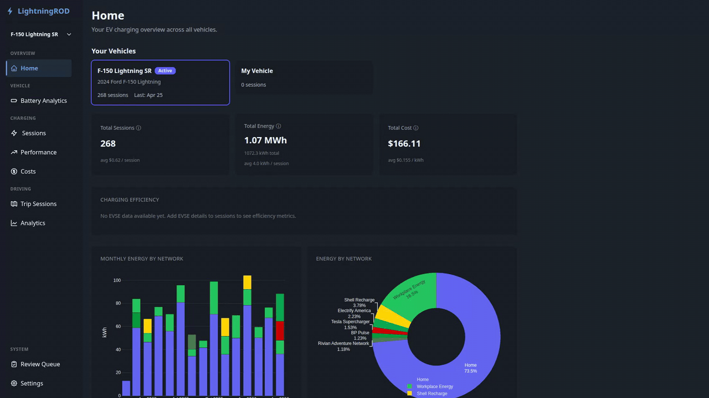

# LightningROD

Self-hosted charging analytics for Ford electric vehicles. Track charging sessions, analyze costs, and monitor energy consumption with a web-based dashboard.

Built for the Ford F-150 Lightning, but should work with any Ford EV.

Designed to support automatic data ingestion from Home Assistant via [ha-fordpass](https://github.com/marq24/ha-fordpass), CSV import, and manual entry.

> [!IMPORTANT]
> This is a work in progress. Do not use this as the only data storage.

### **DEMO** 

An interactive read-only demo is available: https://lightningrod.onrender.com  
**Note**: The  service may need time to wake up.

> [!NOTE]
> **This is my own personal project**
> I am using it for a fun side project, and for learning.

If you would like to, please consider buying me a coffee.

[](https://www.buymeacoffee.com/SquidBytes)


> **Note:** AI (primarily Claude) was used to build this project — see the [AI Usage Disclaimer](https://squidbytes.github.io/LightningROD/ai-disclaimer/) for more information


## Features

- Charging session CRUD with sorting/filtering, group edit, and rich drawer details
- EVSE-aware analytics (loss/utilization), charger stall mapping, and session-level EVSE provenance
  - Charging Network/location/stall management 
- Cost analytics with network/location rate hierarchy, actual vs estimated tracking
- Energy dashboard with efficiency trends, monthly energy by charge type, and regen summaries (when trip data exists)
- Multi-vehicle support with active-vehicle scoping for vehicle-specific pages
- CSV import flow with auto column mapping, timezone handling, duplicate controls, and preview edits
- Home Assistant WebSocket integration with live status and backfill controls

## Project Goals

### Data Ingestion
- **HomeAssistant**
  - [x] ha-fordpass
  - [ ] EVSE
    - Ford Charge Station Pro
    - Open Charge Point Protocol EVSE's
- **Manual Entry**
- **Import** (Charging sessions)
  - [x] CSV
  - [ ] XLSX
  - [ ] EVSE App exports
- **OBD Reader**
  - WiCAN Pro
  - OBDLink MX+
- **Comma.ai** (Will require hardware)
  - BluePilot
  - comma four
  - comma 3X

## Documentation

Full documentation is available at the [documentation site](https://SquidBytes.github.io/LightningROD/).

- [Installation](https://squidbytes.github.io/LightningROD/getting-started/installation/) -- Docker Compose setup and startup
- [Configuration](https://squidbytes.github.io/LightningROD/getting-started/configuration/) -- Environment variables and in-app settings
- [Data Import](https://squidbytes.github.io/LightningROD/getting-started/data-import/) -- CSV format, seed script, classification rules
- [Home Assistant](https://squidbytes.github.io/LightningROD/guide/home-assistant/) -- Real-time FordPass data ingestion via WebSocket
- [Development](https://squidbytes.github.io/LightningROD/development/setup/) -- Running outside of the Docker enviornment with reloading and database access
- [Architecture](https://squidbytes.github.io/LightningROD/development/architecture/) -- Project structure and patterns
- [Database](https://squidbytes.github.io/LightningROD/development/database/) -- Schema, models, migrations

## Acknowledgments

- [ha-fordpass](https://github.com/marq24/ha_fordpass) by marq24 -- Home Assistant integration for Ford vehicles
- [fordpass-ha](https://github.com/itchannel/fordpass-ha) by itchannel -- Home Assistant integration that started this journey
- [TeslaMate](https://github.com/teslamate-org/teslamate) -- Inspiration for the project concept


## Gallery

Selected views from the current release.

### Overview



### Session List and drawer


### Cost Page


### Settings Page


## Quick Start

### Docker Compose (recommended)

```bash
git clone https://github.com/SquidBytes/LightningROD.git
cd LightningROD
cp .env.example .env
# Edit .env -- at minimum, set a real POSTGRES_PASSWORD
docker compose up --build -d
```

The app will be available at `http://localhost:8000`. Migrations run automatically on startup.

### Standalone Docker (single container)

Runs the app in a single container with an embedded SQLite database on a named volume -- no separate database service required.

```bash
git clone https://github.com/SquidBytes/LightningROD.git
cd LightningROD
docker build -f docker/Dockerfile -t lightningrod-web:dev .
docker run -d \
  -p 8000:8000 \
  -v lightningrod-data:/data \
  -e DATABASE_URL=sqlite+aiosqlite:////data/lightningrod.db \
  --name lightningrod \
  lightningrod-web:dev
```

Or using the standalone compose file (overrides `DATABASE_URL` automatically):

```bash
docker compose -f docker/docker-compose.standalone.yml up --build -d
```

Reference the full [documentation site](https://SquidBytes.github.io/LightningROD/).
