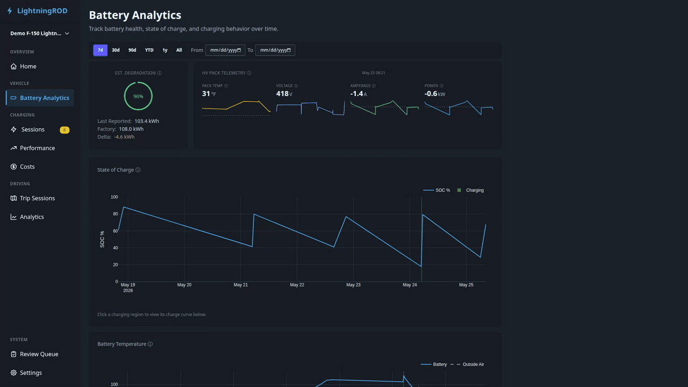

# Battery Analytics

The battery analytics page (`/battery`) tracks long-term battery health, state of charge, charging behavior, and the 12V low-voltage system for the active vehicle.

## Date Range Filter

Pick `7d`, `30d`, `90d`, `YTD`, `1y`, or `All` from the filter bar, or set a custom **From**/**To** date pair. The selection is stored in the URL (`?range=…` or `?date_from=…&date_to=…`).

## Health Summary Cards

Two summary cards appear at the top:

- **Est. Degradation** — current pack capacity as a percentage of the vehicle's rated gross capacity, with last-reported / factory / delta kWh beneath the gauge.
- **HV Pack Telemetry** — a 4-metric grid for battery temperature, voltage, amperage, and power. Each metric shows the latest value plus a 7-day sparkline, with a single freshness timestamp for the card.

Cards use the most recent `ev_battery_status` record. If Home Assistant does not provide a metric, the matching tile shows a "no recent data" state.

!!! info "Usable vs gross capacity"
    LightningROD tracks two capacity numbers per vehicle:

    - **Usable** capacity is the energy you can actually drive with.
    - **Gross** capacity is the full battery size reported by FordPass.

    The health card compares gross to gross so a fresh pack reads close to 100%. If the two values are mixed up, the percentages will be wrong. Both values live on the vehicle record in **Settings → Vehicles** and can be filled from the preset table.

## SOC Timeline

The main chart shows state-of-charge over time, with:

- **Color-coded charging regions** -- brighter green areas highlight periods where power was positive, so charging sessions stand out from rest
- **Click-to-drill** -- click a charging region to filter the Charge Curve panel below to that session
- **Gap-aware** -- data gaps appear as breaks instead of connected lines

Large ranges are simplified on the server to keep the page fast even with years of data.

## Battery Temperature Over Time

A dual-line chart below the SOC timeline showing battery pack temperature (solid) and outside-air temperature (dashed) across the active date range. Charging sessions are overlaid as shaded green regions so you can see what the pack was doing during charge.

The card lazy-loads when it scrolls into view.

## Charge Curve

A charge curve with **SOC % on the X-axis and kW on the Y-axis**. The session picker defaults to the most recent session in the active range, regardless of charge type. Switching sessions only swaps the curve — the rest of the page stays in place.

Up to three lines can appear:

- **Reference curve** — a pre-configured model curve for the active vehicle (loaded from `reference_charge_curves/*.json`). Hidden for AC sessions.
- **Average curve** — your own average across recent DC sessions.
- **Session curve** — the specific session selected above, if any.

AC sessions cap the y-axis at 25 kW; DC sessions keep the 200 kW cap.

A temperature toggle in the legend lets you overlay battery temperature as a second axis.

!!! info "Fallback"
    When fewer than 3 detailed `battery_status` points exist for a session, the app draws a simple line between the start and end SOC. The chart still renders, but the result is less precise.

## Battery Degradation

A scatter plot of usable capacity against **odometer mileage** (km or mi depending on units) with a projected trend line. Date-based degradation is used only when odometer data is missing.

## Performance Notes

- Secondary charts (battery temperature, charge curve, degradation) load when you scroll to them instead of on the initial page load.
- "All"-range queries use server-side downsampling to keep response times reasonable, even with years of data.
