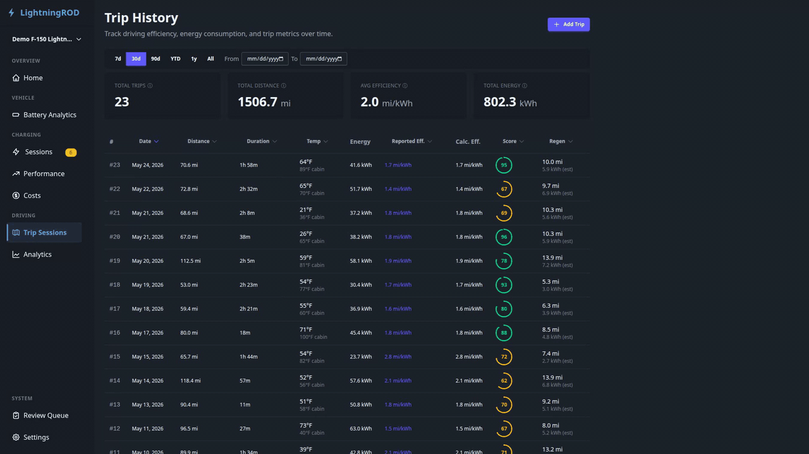
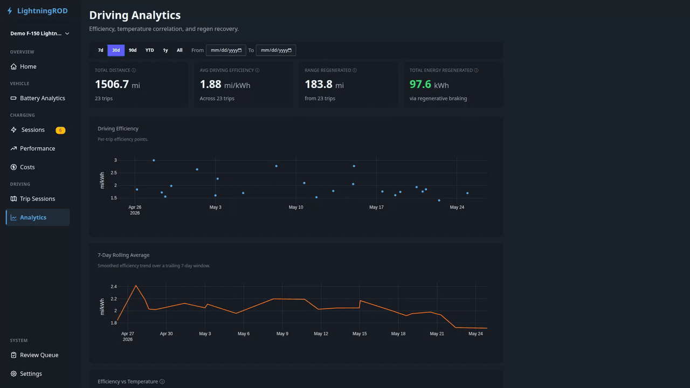

# Driving

The **Driving** section covers what happens between charges: individual trips, efficiency vs temperature, and regen recovery.

It has two pages under the sidebar's `DRIVING` group:

- **Trip Sessions** at `/driving/sessions` — full trip list and detail drawer
- **Analytics** at `/driving/performance` — efficiency correlations and regen trends

!!! note "Renamed from Trips"
    In earlier releases this lived at `/trips`. v0.3 moved it under `/driving/*` so it sits alongside `/charging/*`. The trip data and detail views stayed the same; only the URL and sidebar grouping changed.

## Trip Sessions (`/driving/sessions`)

A paginated table of trips with nine columns: number, date, distance, duration, temperature, energy used, efficiency, driving score, and regeneration.

!!! note "Where efficiency comes from"
    Efficiency is calculated by LightningROD as distance / energy from the trip data. The vehicle's dash may show a lower number for the same trip because its own figure includes climate and accessory energy, while the API's `energy_consumed` covers propulsion only. No independent vehicle-reported efficiency is available through Home Assistant today.

Click any row to open a slide-out detail drawer with:

- **Overview** -- start/end location, distance, duration, energy, temperature
- **Driving scores** — smooth/efficient/safe score breakdown
- **Environment chart** — temperature and altitude over the trip
- **Drive graphs** — SOC, speed, and range on a shared time axis (interpolated segments shown as dotted lines at 40% opacity)
- **Expand** — a full-screen modal with Battery, Environment, and Driving chart sections
- **Delete Trip** — removes the trip after a confirmation prompt

Summary cards above the table - Total Trips, Avg Efficiency, Total Distance, Total Energy - respect the date range filter.

If **Hide short trips** is enabled in [Settings → General](settings.md#trip-display), short key-on trips are left out of the list and summary cards, and a muted note above the table shows how many were hidden.

## Driving Performance (`/driving/performance`)

A driving-side analytics page introduced in v0.3.

### Summary Row

- **Range Recovered (Regen)** -- total regen across trips in range
- Plus per-page summary tiles for total distance, average efficiency, and more

### Driving Efficiency Trend

A time-series chart of mi/kWh per trip (or km/kWh in metric). It mirrors the Charging Efficiency trend on `/charging/performance`.

### Efficiency vs Temperature

A scatter plot of individual trip efficiency against ambient temperature, with a fitted trendline. Useful for spotting cold-weather efficiency loss.

- **X-axis**: ambient temperature (°F or °C per unit preference)
- **Y-axis**: calculated mi/kWh or km/kWh
- **Trendline**: least-squares linear fit, shown only when enough trips have ambient temperature data

### Regen Recovery

A dual-axis bar and line chart showing regen per trip:

- **Bars**: regen kWh per trip
- **Line**: regen percentage per trip
- Most recent trips first, scoped to the current date range

Hover any bar for trip date, regen kWh, regen %, and distance.

## Date Range Filter

Both pages use the same filter bar as the other analytics pages: `?range=` presets (`7d` / `30d` / `90d` / `YTD` / `1y` / `All`) or a custom **From**/**To** date pair.
